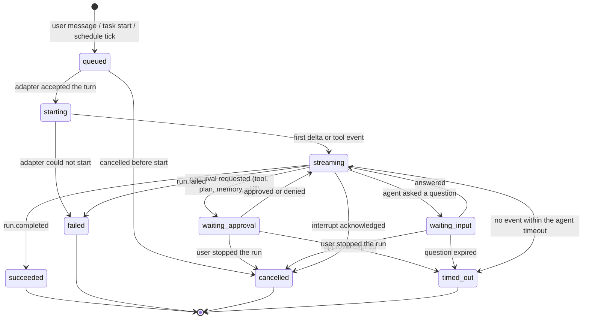
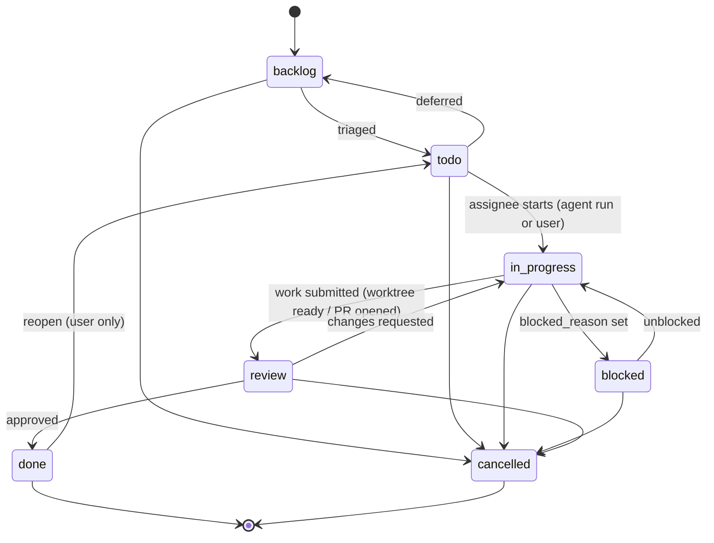
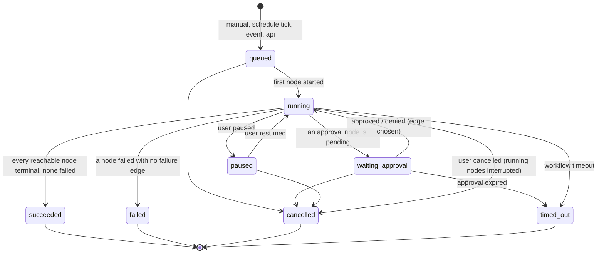
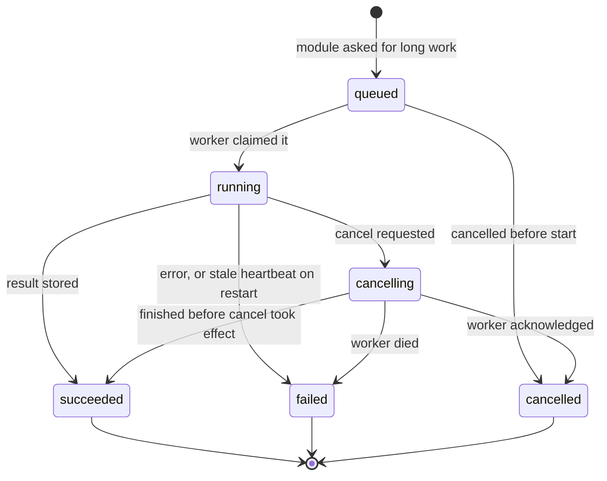

# Domain model

The entities Core Hub stores, who owns each one, how they relate, how the
long-lived ones change state, and what "delete" means. One file per module
sits next to this one; the Drizzle schemas that implement it live in
`packages/server/src/modules/<module>/schema.ts` and are aggregated by
`packages/server/src/db/schema.ts`. Modelling choices and the alternatives
rejected are in `DECISIONS.md`.

Vocabulary is shared with the API contract (`packages/contracts`): the same
words name the same things in a table, a route and a realtime event.

## Conventions

- **Ids are ULIDs** (26 chars, time-sortable), generated by the server before
  insert, never by the database.
- **Every table** carries `id`, `owner_id` (the user who created the row),
  `created_at`, `updated_at` (epoch milliseconds).
- **Scoped tables** also carry `workspace`: the ULID of the workspace named by
  `X-Hub-Profile`. Every query on a scoped table filters by it (invariant 3;
  ADR 0005). Rows are never joined across workspaces.
- **Global tables** have no `workspace` column. They are exactly the entities
  ADR 0005 calls admin-only or host-level: `workspaces`, `users`,
  `app_tokens`, `pairing_codes`, `login_lockouts`, `agent_adapters`, `agents`,
  `devices`, `release_channels`, `releases`, `channel_subscriptions`,
  `push_credentials`, `plugins`, `plugin_tools`.
  Three more carry a **nullable** `workspace` because the same table records
  both hub-level and workspace-level facts: `audit_events`, `jobs`,
  `job_events`.
- **Enums** are `text` columns with a CHECK constraint; the allowed values are
  exported constants next to each table so the contract, the server and the
  tests share one list.
- **Archive** is `archived_at` (nullable timestamp) on entities the UI can
  archive; see §Archive and delete.
- **Secrets** are the only ciphertext in the database; every such column is
  marked `ENCRYPTED` in the schema and masked as `[stored]` on read.
- Table names are plural snake_case (`app_tokens`); entity names in this
  document and in the contract are singular (`app_token`).

## Entity map

Solid lines are foreign keys inside one module (they cascade or set null).
Dotted lines are references by id across modules: no database constraint,
validated by the owning module's API, a 404 when the id is unknown
(invariant 2). Delivery, preference and snapshot tables are omitted here and
drawn in the module files.

```mermaid
erDiagram
  %% auth
  WORKSPACE ||--o{ WORKSPACE_MEMBER : has
  USER ||--o{ WORKSPACE_MEMBER : is
  USER ||--o{ APP_TOKEN : owns
  USER ||--o{ PAIRING_CODE : creates
  PAIRING_CODE }o..o| DEVICE : pairs

  %% agents
  AGENT_ADAPTER ||--o{ AGENT : drives
  AGENT ||--o{ AGENT_SETTINGS : "per workspace"
  AGENT_SETTINGS }o..o| MODEL : "default model"

  %% sessions
  AGENT ||..o{ SESSION : answers
  SESSION ||--o{ MESSAGE : contains
  SESSION ||--o{ RUN : "one per turn"
  RUN ||--o{ TOOL_CALL : makes
  RUN ||--o{ APPROVAL : asks
  TOOL_CALL |o--o| APPROVAL : gated_by
  MESSAGE }o--o| RUN : produced_by
  SESSION }o..o| WORKTREE : works_in

  %% rooms
  ROOM ||--o{ SEAT : seats
  ROOM ||--o{ ROOM_MEMBER : "human members"
  ROOM ||--o{ ROOM_MESSAGE : log
  ROOM ||--o{ HANDOFF : brokers
  SEAT ||..|| SESSION : "backed by"
  SEAT }o..|| AGENT : is
  SEAT ||--o{ ROOM_MESSAGE : speaks
  HANDOFF }o--|| SEAT : from
  HANDOFF }o--|| SEAT : to

  %% tasks
  PROJECT ||--o{ TASK : contains
  PROJECT ||--o{ WORKTREE : hosts
  TASK ||--o{ TASK_TRANSITION : history
  TASK ||--o{ TASK_DEPENDENCY : depends
  TASK |o--o| WORKTREE : "one live worktree"
  TASK }o..o| AGENT : assigned_to
  TASK }o..o| SESSION : "works in"
  TASK }o..o| RUN : "current run"
  TASK }o..o| ROOM : "reports to"

  %% schedules
  SCHEDULE ||--o{ SCHEDULE_RUN : ticks
  SCHEDULE }o--o| WORKFLOW : targets
  WORKFLOW ||--o{ WORKFLOW_RUN : runs
  WORKFLOW_RUN ||--o{ NODE_RUN : nodes
  SCHEDULE_RUN }o--o| WORKFLOW_RUN : produced
  SCHEDULE_RUN }o..o| RUN : produced
  NODE_RUN }o..o| RUN : "agent node"
  NODE_RUN }o..o| APPROVAL : "approval node"
  NODE_RUN }o..o| TASK : "task node"

  %% knowledge
  KNOWLEDGE_NOTE }o..o| PROJECT : about
  KNOWLEDGE_NOTE }o..o| TASK : about
  JOURNAL_ENTRY }o..o| RUN : written_by
  MESSAGE }o..o{ ATTACHMENT : carries
  TOOL_CALL }o..o| ATTACHMENT : "full output"

  %% models
  PROVIDER ||--o{ MODEL : offers
  PROVIDER }o--o| SECRET : "api key"
  MODEL_DEFAULT }o--|| MODEL : "per role"

  %% devices
  USER ||..o{ DEVICE : owns
  DEVICE ||--o{ DEVICE_COMMAND : receives
  DEVICE_COMMAND }o..o| RUN : "awaited by"

  %% notify / updates / audit / plugins
  NOTIFICATION }o..o| DEVICE : pushed_to
  WEBHOOK }o..o| SECRET : signs_with
  RELEASE_CHANNEL ||--o{ RELEASE : publishes
  RELEASE_CHANNEL ||--o{ CHANNEL_SUBSCRIPTION : followed_by
  CHANNEL_SUBSCRIPTION }o..|| DEVICE : device
  USAGE_RECORD }o..|| RUN : "cost of"
  JOB ||--o{ JOB_EVENT : logs
  AGENT }o..o| JOB : "install job"
  WORKTREE }o..o| JOB : "create job"
  PLUGIN ||--o{ PLUGIN_BINDING : "per workspace"
  PLUGIN ||--o{ PLUGIN_TOOL : exposes
```

### Reading the map

- A **workspace** is a filter, not a container: scoped rows carry its id and
  nothing else points at it. Switching workspace changes a header and
  refetches (ADR 0005).
- A **session** is one agent answering one user (or one task, schedule, seat).
  Each user turn becomes a **run**: the streamed unit with its tool calls and
  approvals. Messages are the transcript the hub received; the agent's own
  files stay in the agent's home.
- A **room** holds **seats**; every seat is one agent backed by its own
  session. Room messages are a separate log from session messages
  (`DECISIONS.md` §1).
- A **task** in the Tasks section is assigned to a user or an agent, works in one
  session, and has at most one live **worktree**. Its history is
  `task_transition` rows, never overwritten.
- A **schedule** ticks into **schedule_run** rows, each of which produced
  either a session run (prompt schedules) or a **workflow_run** whose
  **node_run** rows point back at the runs, approvals and tasks they created.
- **usage_record** rows (audit) are the only place cost lives; they are keyed
  by run and copy the run's origin so cost rolls up by task, schedule or room
  without joins.
- A **job** is any long work (install, worktree creation, reindex, update)
  with progress; HTTP returns its id at once (invariant 4).

## Ownership per module

Invariant 1: each entity is created by exactly one module and referenced by
id everywhere else. The referencing module asks the owner through its public
`index.ts` (existence check, read models); it never writes the owner's rows.

| Module | Creates (owns) | References by id |
|---|---|---|
| `auth` | workspace, workspace_member, user, app_token, pairing_code, login_lockout | attachment (avatar), device |
| `agents` | agent_adapter, agent, agent_settings | job (install), model, secret |
| `sessions` | session, message, run, tool_call, approval | agent, model, worktree, attachment, user; origin ids (task, schedule_run, node_run, seat) |
| `rooms` | room, room_member, seat, room_message, handoff | agent, session, run, user, attachment |
| `tasks` | project, task, task_transition, task_dependency, worktree | agent, user, session, run, room, job |
| `schedules` | schedule, schedule_run, workflow, workflow_run, node_run | agent, model, run, approval, task |
| `knowledge` | knowledge_note, journal_entry, attachment | project, task, agent, run |
| `models` | provider, model, model_default, secret | — |
| `devices` | device, device_request, push_credential | app_token, user (requester), session, run, job |
| `notify` | notification, notification_delivery, notification_preference, webhook, webhook_delivery | device, secret, any entity (deep link) |
| `updates` | release_channel, release, channel_subscription | device |
| `audit` | audit_event, usage_record, performance_snapshot, job, job_event | run, session, agent, provider, device, any entity |
| `plugins` | plugin, plugin_binding, plugin_tool | job, secret, agent |

Entity count: 6 + 3 + 5 + 5 + 5 + 5 + 3 + 4 + 2 + 6 + 3 + 5 + 3 = **55**.

`job` lives in `audit` because audit already owns logs and operational
records and every other module needs jobs from Phase 0; a dedicated `jobs`
module would need an ADR that changes `ARCHITECTURE.md` (`DECISIONS.md` §6).

## Lifecycles

Every machine has explicit terminal states, marked `[*]` on the way out.
Transitions are performed only by the owning module, which also emits the
matching realtime event (`run.failed`, `task.moved`, `workflow_run.paused`,
`job.progress`).

### run

Terminal: `succeeded`, `failed`, `cancelled`, `timed_out`. A run that is
terminal never changes again; a retry is a new run with `attempt + 1`.



`tool_call` inside a run: `pending → running → succeeded | failed | cancelled`,
or `pending → denied` when its approval is denied. `approval`:
`pending → approved | denied | answered | expired | cancelled`; all five are
terminal.

### task

Terminal: `done`, `cancelled`. `cancelled` is absolute. `done` is terminal for
agents, schedules and workflows; a **user** may reopen it (`done → todo`),
which is recorded as a transition with `note = "reopened"` and clears
`completed_at`. Every arrow writes a `task_transition` row.



`worktree` follows the task: `creating → ready → dirty ⇄ ready → merged → removed`,
with `failed` from `creating` and `removed` reachable from every non-terminal
state; `removed` and `failed` are terminal and free the task's "one live
worktree" slot (partial unique index on `task_id where removed_at is null`).

### workflow_run

Terminal: `succeeded`, `failed`, `cancelled`, `timed_out`. Node runs inside it
are `pending → running → succeeded | failed | skipped | cancelled`, with
`waiting_approval` between `running` and its outcome for approval nodes.



### job

Terminal: `succeeded`, `failed`, `cancelled`. A worker heartbeats
`heartbeat_at`; on server restart every `running` or `cancelling` job with a
stale heartbeat is moved to `failed` with `error_code = "stale"`.



Smaller machines are documented with their module: `handoff`,
`schedule_run`, `device_request`, `notification_delivery`,
`webhook_delivery`, `plugin` install state and `plugin_binding` status.

## Archive and delete

Three operations, and each entity supports a fixed subset:

| Operation | Meaning | Applies to |
|---|---|---|
| **archive** | `archived_at` set; hidden from default lists; every reference still resolves; reversible | workspace, agent, session, room, project, task, schedule, workflow, knowledge_note, journal_entry, provider, model, secret, webhook, plugin |
| **purge** | hard delete of an archived row and its intra-module cascade after the retention window (default 30 days, per workspace setting; `never` allowed) | session (+ messages, runs, tool_calls, approvals), room (+ members, seats, messages, handoffs), project (+ tasks, transitions, dependencies, worktrees), schedule (+ schedule_runs), workflow (+ workflow_runs, node_runs), knowledge_note, journal_entry |
| **delete now** | immediate hard delete, offered only where nothing else can reference the row or the reference is designed to dangle | app_token, pairing_code, workspace_member, room_member, task_dependency, model_default, notification, notification_preference, channel_subscription, plugin_binding, device (revoke, then delete) |

Rules:

1. **Cross-module references never cascade.** Purging a session leaves
   `usage_records.session_id`, `tasks.session_id` and `seats.session_id`
   pointing at a missing row. The owning API answers 404 `{ error, code:
   "not_found" }` for that id; the referencing module renders "deleted" and
   never guesses (invariant 2).
2. **Ledgers are immutable.** `audit_events`, `usage_records`,
   `task_transitions`, `job_events`, `schedule_runs`, `webhook_deliveries` are
   never updated or deleted by a user action; retention jobs may trim them by
   age, oldest first, and that trim is itself an audit event.
3. **Secrets are wiped, not deleted.** Deleting a secret nulls `ciphertext`
   and `nonce`, sets `wiped_at`, keeps the row so `providers.api_key_secret_id`
   and audit rows still resolve; the UI shows "[wiped]".
4. **Attachments are unlinked lazily.** `deleted_at` marks the bytes gone; the
   row stays so messages still render "attachment removed". A sweeper deletes
   rows nothing references after the retention window and files past
   `expires_at`.
5. **Archiving a parent hides its children** without touching them: an
   archived project hides its tasks from the Tasks section; un-archiving restores
   them.
6. **Runs, tool calls and approvals are never archived individually.** They
   live and die with their session.
7. **Workspaces archive only.** Purging a workspace is an owner-only job that
   purges every scoped row of that workspace module by module, and is the one
   place a cross-module delete is allowed, because the scope itself is going.

## What is deliberately not stored

- Agent private state: Hermes memory files, skills sources, Claude/Codex
  project memory, ACP session files. The hub stores the reference
  (`agent_session_ref`) and the transcript it received.
- Bearer tokens and passwords: only hashes.
- Socket presence (who is connected now) and streaming deltas: in memory,
  emitted as events, never persisted; the final message is.
- Client IP addresses, except the throttled subject in `login_lockouts`.
- Hostnames of the owner's servers: configuration, never rows.
